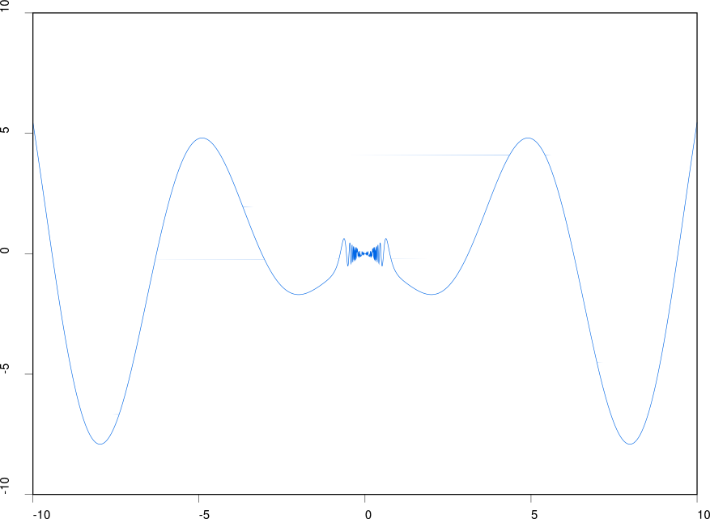
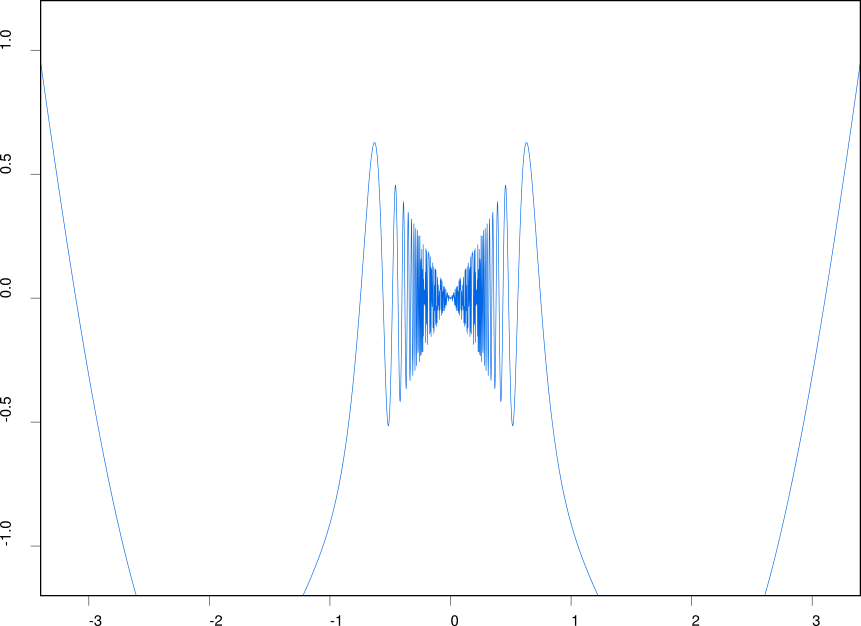

# Graph - plotting utility for mathematical functions

Seminar assignment from course **Programming in C**.
Aim of this assignment is to make a program to produce vector function plots
in postscript of single variable functions. I made it so that the resulting 
plots are visually similar to plots produced by R language.

## Usage
```
usage: ./graph FUNCTION FILE [LIMITS]
```

Run the program with arithmetic **function** as a first parameter. This function
might contain a single variable **x**, no other letters are recognized. Use
output **FILE** ending in .ps as a second parameter and optionally use third
parameter to specify **LIMITS** of the plot. Default boundaries are from -10 to
10 for both x and y axes.

Syntax for LIMITS:
```
x_min:x_max:y_min:y_max
```

To convert the plot from ps to pdf use utility
[ps2pdf](https://www.ps2pdf.com/) which should be easily available for your
linux distribution.

```
ps2pdf out.ps out.pdf
```


## Examples

### 1. With default boundaries
```
./graph "sin(x + 1/x^3) * -x" out.ps
```
<p align="center">
  <a href="pics/ex1.png"></a>
</p>

### 2. User defined boundaries
```
./graph "sin(x + 1/x^3) * -x" out.ps -3.4:3.4:-1.2:1.2
```
<p align="center">
  <a href="pics/ex1.png"></a>
</p>


## Documentation
For full documentation in czech language see [A10B0632P.pdf](doc/A10B0632P.pdf).

## Course details
* [KIV/PC](http://www.kiv.zcu.cz/studies/predmety/pc/) fall 2011
* Lecturer [Ing. Kamil Ekštein, Ph.D.](https://www.kiv.zcu.cz/cz/katedra/osoby-seznam/osoba-detail.html?login=kekstein)
* Faculty of Applied Sciences - University of West Bohemia (Fakulta Aplikovaných Věd - ZČU Plzeň)

